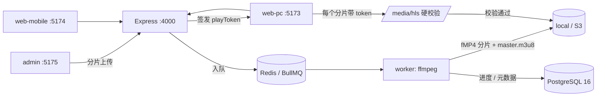

# videoX

全栈视频平台。Express 5 + PostgreSQL 16 + ffmpeg HLS 转码后端，配合 PC 前台、移动端仿 APP 前台、管理后台三个独立端口的 React 19 应用，包含自研播放器、卡密会员体系、HMAC 防盗链、算法 + AI 双推荐引擎与访客统计。

---

## 一键启动

前置条件：Node ≥ 20.19（推荐 22+）、Docker Desktop。**不需要**本机安装 ffmpeg 或 psql——前者由 `ffmpeg-static` 提供，后者跑在容器里。

```bash
npm install          # 安装全部 workspace 依赖
cp .env.example .env # Windows: copy .env.example .env
npm run setup        # 起容器 → 等待就绪 → 建表 → 灌种子数据
npm run dev          # 并行拉起 api / worker / pc / mobile / admin
```

`npm run setup` 等价于 `npm install && npm run db:up && node scripts/wait-for-db.mjs && npm run db:migrate && npm run db:seed`，可重复执行（迁移与种子都是幂等的）。

### 端口一览

| 服务 | 地址 | 说明 |
| --- | --- | --- |
| API | http://localhost:4000 | Express 5，统一 `{ code, message, data, traceId }` 响应 |
| PC 前台 | http://localhost:5173 | ChatGPT/Claude 风格左侧边栏 |
| 移动端 | http://localhost:5174 | 仿原生 APP，底部四 Tab，可装 PWA |
| 管理后台 | http://localhost:5175 | 仪表盘 / 内容 / 会员 / 运营配置 |
| PostgreSQL | localhost:15433 | 容器内仍是 5432，对外换端口避开本机已装的 PG |
| Redis | localhost:6380 | 同上，避开 6379 |
| worker | 无端口 | BullMQ 消费者：转码 / 统计聚合 / AI 打分 |

移动端在桌面浏览器里请开 DevTools 的设备模拟，否则布局会按窄屏渲染在页面左侧。

### 种子账号

| 账号 | 密码 | 角色 |
| --- | --- | --- |
| `admin@videox.local` | `Admin@123456` | 管理员，可登录后台 |
| `vip@videox.local` | `Demo@123456` | 已开通会员，用于验证门禁放行 |
| `user@videox.local` | `Demo@123456` | 普通用户，用于验证会员门禁拦截 |

种子还会写入 10 个分类、30 个标签、4 个套餐、5 个创作者、若干演示视频，以及每个套餐 5 张兑换码（控制台会打印示例码）。管理员账号可通过 `SEED_ADMIN_EMAIL` / `SEED_ADMIN_PASSWORD` 覆盖。

---

## 仓库结构

npm workspaces 单仓多包。移动端**不复用** PC 业务组件——`packages/ui` 只放无样式倾向的基础原语与设计令牌。

```
videoX/
  docker-compose.yml        postgres:16 + redis:7
  packages/
    shared/                 类型、zod schema、API 客户端、playToken 签名与校验
    ui/                     OKLCH 设计令牌 + shadcn(new-york) 基础原语
    player/                 自研播放器：headless core + PC 皮肤 + 移动皮肤
    db/                     Drizzle schema、迁移、种子、重置
  apps/
    api/                    Express 5 · :4000
    worker/                 转码 / 聚合 / AI 打分消费者
    web-pc/                 PC 前台 · :5173
    web-mobile/             移动端前台 · :5174
    admin/                  管理后台 · :5175
  scripts/                  等待数据库、图标生成、冒烟与端到端脚本
  tests/                    Vitest 用例
```

## 数据流



---

## 核心机制

### 上传与转码

三段式分片上传：`POST /api/uploads/init`（返回已存在分片列表，支持断点续传与整文件 SHA-256 秒传去重）→ `PUT /api/uploads/:id/part/:n`（逐片校验 SHA-256）→ `POST /api/uploads/:id/complete`（合并入队）。

worker 侧直接 `spawn` ffmpeg 并解析 `-progress` 管道拿实时百分比：ffprobe 探测 → sharp 出封面/雪碧图/`thumbnails.vtt` → 多码率阶梯 → `master.m3u8`。输出 fMP4/CMAF，各档关键帧对齐（`-g` 固定 + `-sc_threshold 0`），按源高度裁剪绝不上采样。360p 档优先产出并把视频标记为 `partially_ready` 立即可播，其余档位后台补齐后热更新 master。会员视频额外做 HLS AES-128 加密。

### 防盗链 playToken

`packages/shared/src/play-token.ts` 签发 `v1.<payload>.<signature>`，HMAC-SHA256 覆盖 `videoId|userId|exp|ipPrefix|uaHash|nonce|scope`。

`/media/hls/:videoId/*` 对**每一个** manifest、分片与密钥请求硬校验：签名 → 过期 → IP 段与 UA 绑定 → 会员权益 → Redis 并发观看数上限。manifest 返回时动态给分片 URL 拼 token，播放器在剩余寿命不足 25% 时静默续签。AES-128 密钥由主密钥 + videoId 派生，因此不必落库。

IP 默认只绑定前三段（IPv4）——完整绑定会让移动网络切基站时频繁失效。设 `PLAY_TOKEN_IP_PREFIX_PARTS=0` 可关闭 IP 绑定。

### 卡密兑换防双花

`redeemCode` 在单个事务里 `SELECT ... FROM redeem_codes WHERE code = $1 FOR UPDATE`，并发请求会阻塞在行锁上而不是各自读到 `unused`。锁内复核状态与有效期 → 置 `used` → 顺延订阅到期时间（已是会员则从原到期日往后加，不是从今天重算）→ 写订单流水。任何一步失败整体回滚，不存在「码已核销但会员没到账」的中间态。

### 双轨推荐

1. **算法推送**：播放/完播/点赞/收藏/关注带时间衰减聚合成 `user_tag_affinity` 画像 → 五路召回（标签命中 / 分类命中 / 热门 / 新品 / 协同共看）→ 加权打分（亲和度 × 质量 × 新鲜度 × 完播率 × 热度 × AI 分 − 曝光惩罚）→ MMR 重排保证多样性并限制同作者同分类占比 → 探索位注入冷启动内容。全部权重来自 `algo_weights` JSONB，后台可视化调参。
2. **AI 重排**：worker 按管理员配置的 OpenAI 兼容 endpoint / model / 提示词分批打分，回写 `ai_score` 与理由参与最终排序。

---

## 常用命令

| 命令 | 作用 |
| --- | --- |
| `npm run dev` | 并行启动全部五个服务 |
| `npm run dev:api` / `:worker` / `:pc` / `:mobile` / `:admin` | 单独启动某一个 |
| `npm run db:up` / `db:down` / `db:logs` | 容器起停与日志 |
| `npm run db:migrate` / `db:seed` / `db:reset` | 迁移 / 种子 / 清库重来 |
| `npm run db:generate` | 改完 schema 后生成迁移 SQL |
| `npm run db:check` | 检查数据库连通性 |
| `npm run typecheck` | 全 workspace tsc |
| `npm test` | Vitest 全量 |
| `npm run smoke` | 接口冒烟（需 api 在跑） |
| `npm run e2e` | 全链路验收（需 api + worker 在跑） |
| `npm run build` | 构建三个前端 |
| `npm run icons` | 重新生成 favicon 与 PWA 图标 |

## 测试

```bash
npm test
```

- `tests/play-token.test.ts` —— 签发/校验、篡改 payload、过期、跨视频复用、换 IP 换 UA、密钥派生。纯逻辑，不依赖外部服务。
- `tests/recommend-scoring.test.ts` —— 打分加权、特征折算（新鲜度半衰期 / 对数热度 / 曝光惩罚封顶）、MMR 多样性与同作者同分类上限、探索位替换。
- `tests/redeem-lock.test.ts` —— 兑换行锁。**需要数据库在跑**，其中「8 个并发请求抢兑同一张卡只能成功 1 次」是核心断言；数据库不可达时该文件自动跳过。

### 全链路验收

`npm run e2e` 会真的跑一遍：注册 → 分片上传 → 等待 ffmpeg 转码 → 卡密开会员 → 签票取加密流。同时覆盖若干负面用例——无票取流 403、换 UA 取流 403、非会员拿不到完整票、无票取密钥 403、秒传副本的密钥地址被正确改写。脚本会清理自己造的数据。

---

## 环境变量

见 `.env.example`，每一项都有注释。生产部署必须替换的是五个密钥：

```bash
openssl rand -hex 32   # JWT_ACCESS_SECRET / JWT_REFRESH_SECRET / PLAY_TOKEN_SECRET / HLS_KEY_SECRET / COOKIE_SECRET
```

存储默认写本地磁盘 `./storage`。S3 兼容（MinIO / R2 / OSS）在管理后台「存储配置」里配置并持久化到数据库，支持「测试连接」与 CDN 域名，改完即时生效，不需要重启。

## 已知取舍

- 中文全文检索走 `pg_trgm` 三元组近似，没有引入 `zhparser`（需要自编译扩展镜像）。Postgres 内置分词器不切中文，这是精度换部署简单度。
- 单机 ffmpeg 软编，转码耗时取决于本机 CPU。`TRANSCODE_HWACCEL` 预留了 nvenc / qsv 开关，默认关闭以保证可移植。
- TypeScript 固定 5.9.3。registry 上的 7.x 是新编译器，周边 lint 与构建插件生态尚未完全跟进。
- 地域解析需要自行下载 MaxMind GeoLite2-City.mmdb 并配置 `GEOIP_MMDB_PATH`，留空则只记录设备与来源，不记录地域。
